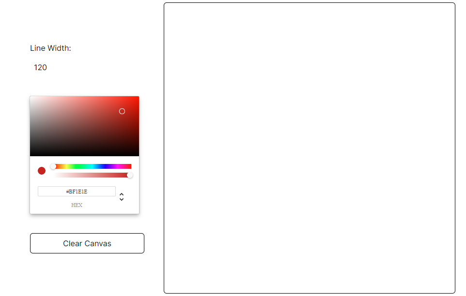

## Draw-A-Bit

#### A minimal setup for sketching.



##### **Made with**


## How to contribute

First, run a development Server:

```bash
npm run dev
# or
yarn dev
# or
pnpm dev
# or
bun dev
```

Open [http://localhost:3000](http://localhost:3000) with your browser to see the result.

Open a new Branch and Request a Pull Request

## Deployed on Vercel

Check out our Site [here](https://draw-a-bit.vercel.app/) for more details.
